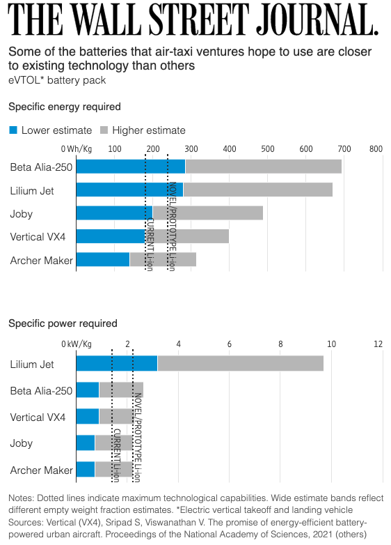

# EVTOL battery sizing and energy consumption estimation model

This repo accompanies the paper "[The promise of energy-efficient battery-powered urban aircraft](https://doi.org/10.1073/pnas.2111164118)" by Shashank Sripad and Venkat Viswanathan. _Proceedings of the National Academy of Sciences_, November 9, 2021 118 (45) e2111164118

### News
#### Aug 25, 2022
> The specific energy estimates were presented in a follow-up article in [The Wall Street Journal](https://www.wsj.com/articles/liliums-air-taxi-is-arriving-too-early-11661429432?reflink=desktopwebshare_permalink) by Jon Sindreu.
> 

#### Jul 6, 2022
> The Ragone plot from the work was featured in [The Wall Street Journal](https://www.wsj.com/articles/batteries-become-do-or-die-for-air-taxi-startups-11657098176?reflink=desktopwebshare_permalink) by Jon Sindreu. A new EVTOL VX4 from Vertical Aerospace was also shown in the list. 
> 

#### Dec 16, 2021
> Figure 2 from the paper which shows the battery requirements for various EVTOL aircraft was featured in a Forbes [story](https://www.forbes.com/sites/jeremybogaisky/2021/12/16/beta-technologies-amazon-ups-evtol/?ss=entrepreneurs&sh=3fa334762c24) by Jeremy Bogaisky about Beta Technologies
> 
> 

#### Dec 14, 2021
> The paper was mentioned in a [story](https://evtol.com/features/elon-musk-supersonic-electric-vtol-jet/) by Elan Head on eVTOL.com

#### Nov 29, 2021
> We spoke to the Beta Technologies team who provided additional inputs. See the [LinkedIn update post](https://www.linkedin.com/posts/ssripad_were-thrilled-by-all-the-feedback-and-discussions-activity-6871141765634699264-3xaM).
> 

#### Nov 20, 2021
> [Mark Moore](https://www.linkedin.com/in/mark-moore-99582787/?miniProfileUrn=urn%3Ali%3Afs_miniProfile%3AACoAABJ0JsEBBhojAWp_v_kPEA5UB4FAjDB42e4), pioneer of Distributed Electric Propulsion and revered aerospace engineer [posted](https://www.linkedin.com/posts/mark-moore-99582787_while-others-have-focused-on-the-emissions-activity-6867855419902099458-IPUf) about the paper.
>> [Daniel Raymer](https://g.co/kgs/cQfVaJ) [commented](https://www.linkedin.com/feed/update/urn:li:activity:6867855419902099458?commentUrn=urn%3Ali%3Acomment%3A%28activity%3A6867855419902099458%2C6867885475592568832%29) about it!
> 
> 

#### Nov 5, 2021
> The paper was covered in [Big Think](https://bigthink.com/the-future/flying-cars-evtol-aircraft/) by Ross Pomeroy

#### Nov 1, 2021
> The paper was accepted for publication in the [Proceedings of the National Academy of Sciences](https://doi.org/10.1073/pnas.2111164118)
